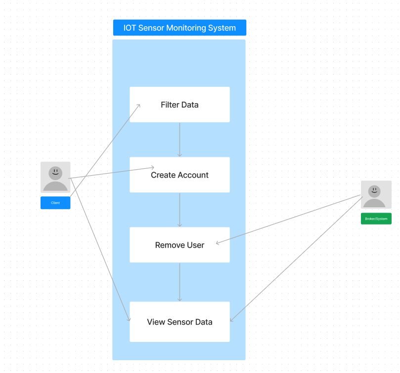
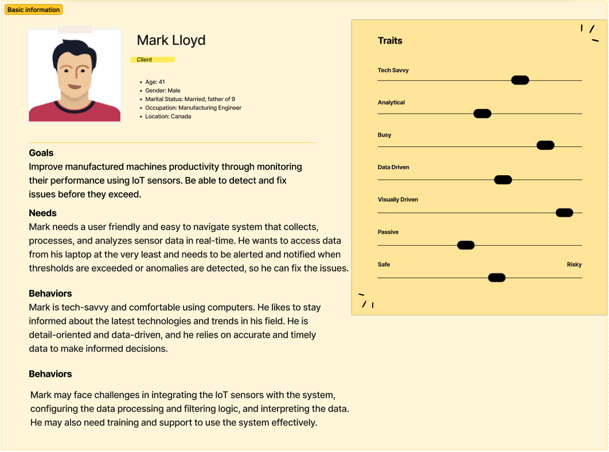

# The Project

The project provides you an opportunity to build upon the foundational knowledge acquired in this course. It is designed to help you develop an advanced understanding of software engineering principles, tools, and techniques using structured requirements gathering and analysis, software development process, design patterns, software architecture, and software testing.  You will also need to consider your development methodology (don’t use waterfall), software metrics, and software quality assurance.

As a team, you will select a project, develop a set of requirements, conduct a formal analysis of the project, develop an architecture, and then using TDD and an Agile workflow, iterate and develop your projects.  During your project, you MUST consider design patterns and anti-patterns, TDD, dockerization, and CI/CD.  The goal is not necessarily to build a complex system, but to practice and become comfortable with the techniques, be able to analyze and decompose a problem, and incrementally develop and deploy a solution using a branching workflow.

Internally, within your team, you are free to manage efforts and tasks with the understanding that everyone is expected to contribute equally in some fashion.  During the project, you will have the chance to confidentially conduct peer reviews using the credit-earned model (see document on Canvas regarding this) at a number of key points.   Your individual project grade will be impacted using the results of the peer evaluation.   The key point is that if you don’t contribute to the project, your mark will reflect this.  This will be discussed in class.

You must have:

* Unit tests and integration tests to ensure code quality and functionality
* A deployment pipeline using CI/CD to automatically test and deploy changes to the codebase
* Identified what design patterns you are using and describe why
* Dockerized deployment
* Continual and ongoing work using TDD 
*A team between 3-5 people (no more, no less) - target for 4

## Project Goals:

* To deepen the students' understanding of software engineering principles, tools, and techniques.
* To enable students to apply software engineering principles, tools, and techniques to the development of complex software systems.
* To introduce students to agile development methodologies, software metrics, and software quality assurance.
* To foster collaboration and teamwork among students in the development of software systems.

## Project Objectives:

By the end of this project, students will be able to:

* Apply the software development process model, to the development of a software system
* Design software systems using appropriate design patterns and principles
* Develop software architectures for complex software systems
* Use software testing techniques to ensure the quality of software systems
* Apply agile development methodologies to the development of software systems
* Apply software metrics to evaluate the quality of software systems
* Develop software quality assurance plans to ensure the quality of software systems
* Apply and develop a CI/CD pipeline for automated testing and deployment
* Utilize dockerization to containerize your application
* Work collaboratively in teams to develop software systems
* Peer Evaluation: see Peer Evaluation

## Evaluation:

**Milestone #1** – Team Formation and Planning Framework (March 7th) – Set up and join your team.   Let me know who is on your team (2%)

**Milestone #2** – Project Description and Requirements (March 13th).  A summary of “What” your project is, who the users are, and “What” your project will do (functional, non-functional requirements, etc) including use cases (properly dressed with the appropriate level of abstraction.   Consider the tools (proto-personal, journey lines)(13%)

**Milestone #3** – Formal Analysis and Architecture (March 19th).  
 * Use the appropriate models to present the details about what your system will look like, what it will do/be composed of and what your architecture is. (20%)
 * Test plan (5%)

**Milestone #4** – Testing/R&R Report/Release #1 (March 26th) (10%)

**Milestone #5** – Testing/R&R Report/Release #2 (April 2nd) (10%)

**Milestone #6** – Final Report/Demo video (April 9th) (20%)

**CI/CD (2 X 5%)**

**Process (2 x 5%)**

## The Projects:

**Discord Clone:** This project involves the development of a web-based platform for online communication and collaboration, similar to the popular chat app, Discord. The platform should incorporate the Observer design pattern to notify users of new messages, and the Mediator design pattern to manage communication between users and channels. The platform should also implement the Singleton design pattern to ensure that only one instance of the chat server is running at any given time, and the Command design pattern to enable users to execute commands (e.g. change username, join channel). Additionally, the platform should incorporate Continuous Integration and Deployment (CI/CD) and automated testing to ensure that updates are deployed quickly and without errors.

**iClicker Clone:** This project involves the development of a web-based platform for classroom polling and feedback. The platform should allow instructors to pose questions to students and receive instant feedback. The platform should incorporate the Observer design pattern to notify the instructor of student responses, and the Facade design pattern to simplify the interface between the user and the underlying system.  Additionally, the system should incorporate Continuous Integration and Deployment (CI/CD) and automated testing and deploy quickly and without errors. 

**Online Marketplace Application:** This project involves the development of a web-based application that facilitates online transactions between buyers and sellers. The application should incorporate the MVC (Model-View-Controller) design pattern to separate the concerns of the application into different components. The application should also implement the Observer design pattern to notify users of updates to their transactions.  Additionally, the system should incorporate Continuous Integration and Deployment (CI/CD) and automated testing.

**IoT Sensor Monitoring System:** This project involves the development of a system for monitoring and analyzing data from IoT sensors using MQTT. The system should incorporate the Publish-Subscribe design pattern to enable sensors to publish data and clients to subscribe to relevant data streams. The system should also implement the Chain of Responsibility design pattern to manage and filter data streams, and the Adapter design pattern to enable different types of sensors to communicate with the system. Additionally, the system should incorporate Continuous Integration and Deployment (CI/CD) and automated testing to ensure that data is collected accurately and without errors. The system should provide real-time visualizations of sensor data and alert users when thresholds are exceeded.

### IoT Sensor Monitoring System

## What:

- define what types of systems we are interested in monitoring - eg. weather, production systems, IT systems, chemical monitoring, diaper filling
- define who will be interested in monitoring said systems
- define the goals/desired outcomes of monitoring these systems
- **Application that reads data from sensors which allows clients (with an account) see a summary and visualization of the data**

## Users:

- Client (primary)
- Admin

## Function Requirements:

- Data collection  - collect data from IoT devices and sensors (real time)
- Notification/Alerts - alert users when thresholds are exceeded or encountered
- Process data - provide meaningful results from collected data
    - Display data (graphs, etc)
    - Export data in relevant formats (csv, etc)
- Store Data- store the collected data in a local database or on the cloud
- Remote Monitoring - User can choose which sensors they wish to monitor
- System should be able to handle growing sensor data collection over time and maintain system performance for increased traffic **(both functional and non-functional)**
- Requires account to view data
- Ease of use for the user - the application should allow them to access data without needing an advanced understanding of the technology as would traditionally be required to access data from the IoT

## Non-functional Requirements:

- Secure Data - Ensure privacy/security of data collected from sensors
    - Data is collected, handled, and stored in a secure and private manner
- Usability of System - Implement user interface that is intuitive and easy to use/navigate by the user
- Maintainability of the system - System should be easy to maintain and update
- Performance/Efficiency - System should be able to withstand high traffic (data volume) and perform to its best capabilities
- Reliable - Consistence performance according to its specifications with little to none issues and failures

# Use cases:

## **Use Case 1. View Sensor Data**

**Primary actor:**  Client

**Description:**  Process of a client viewing sensor data of their choosing

**Pre-condition:** User must login and have a valid account

**Post-condition:** The client views the sensor data of their choosing

### Main scenario:

1. Client Logs in or creates an account (Use case 2)
2. Client goes to the Sensor data page
3. Client filters or “subscribes” to the sensor data that they would like to see
4. Client can select specific sensors and the web application displays data and graphical visualizations from said sensor/sensors.
5. Client can select the date range of the data being shown.

### Extensions:

1a. Client tries to view data without an account

1a1. Displays message that client must login or create an account

2a. Cannot access sensor data page

2a1. Displays error and informs client they cannot access that data/page

## **Use Case 2. Create Account**

**Primary actor:**  Client

**Description:**  Process of creating an account to view/access the system 

**Pre-conditions:**  The user must have access to the system's user interface and must not have an account in the system

**Post-condition:** The user’s account has been created and information is stored securely in the database.

### Main scenario:

1. The user accesses the system's user interface.
2. The user clicks on the "Create Account" button.
3. The system displays a form for the user to enter their account information, including their name, email address, and password.
4. The user enters their account information and clicks the "Create" button.
5. The system validates the user's information and checks if the password/email is unique.
6. If the user's information is valid, the system creates an account for the user and stores their information securely in the database.
7. The system displays a confirmation message to the user, indicating that their account has been created successfully.

### Extensions:

5a. Client enters invalid information in the form (weak password or invalid email)

1a1. system displays an error message and prompts the user to correct their information before proceeding.

5a2. Client enters email that is already registered or associated with another account

2a2. Displays error message and prompt user to enter a different email address

## **Use Case 3. Filter Data**

**Primary actor:**  Client

**Description:** Process to allow a user to choose what data they would like displayed (specific subset of data)

**Pre-condition:** User must login

**Post-condition:** The client has a filtered list of data they are viewing

### Main scenario:

1. Client Logs in or creates account (Use case 2)
2. Client accesses data list
3. Client selects data inputs they would to view 
4. Client specifies the criteria for filtering the data (e.g., date range, category, location, etc.)
5. System applies filters to client account
6. Filtered dataset is displayed to Client

### Extensions:

2a. Client tries to filter data without an account

2a1. Displays message that client must login or create an account

4a. Client enters invalid criteria

4a1. Displays message for invalid criteria and prompts user to re enter field

## **********************************Use Case 4. Remove Client**********************************

**Primary actor:** Admin

**Description**: Process to allow admin to remove user account/details

**Pre-condition:** Admin is authorized to remove a user who is already registered

**Post-Condition:** Client account and details are no longer in the database

### Main Scenario:

1. User is registered (Use case 2)
2. User notifies system of account issues
3. Admin is notified and begins account removal process
4. Account is removed
5. User is notified of account removal

### Extensions:

1.1 User Account not registered

1.1.1 Return error message saying that the requested action cannot be completed

5.1 Further instructions after removal

5.1.1 If the account removal is successful, the system should notify the user that their account has been removed and provide any instructions for new account 

[https://www.figma.com/file/JdDww9h7dXpK85f1QG3KyN/IOT-Sensor-Monitoring-System-Use-Case-Diagram?node-id=0%3A1&t=8nQQQVcqdf4BIGLo-1](https://www.figma.com/file/JdDww9h7dXpK85f1QG3KyN/IOT-Sensor-Monitoring-System-Use-Case-Diagram?node-id=0%3A1&t=8nQQQVcqdf4BIGLo-1)

## Proto-personas:

### Client:

The client is someone who’s interested in this particular sub-set of data from the IoT, is tech savvy, and has the desire to configure their own solution, and instead wants a curated picture of what a set of sensors has collected. 

 ************************************[https://www.figma.com/file/Mx0OgtIclSJBzjdbk64YCO/User-persona-(Community)?node-id=0%3A1&t=9RtlnmPpxnJlZFb5-1](https://www.figma.com/file/Mx0OgtIclSJBzjdbk64YCO/User-persona-(Community)?node-id=0%3A1&t=9RtlnmPpxnJlZFb5-1)

