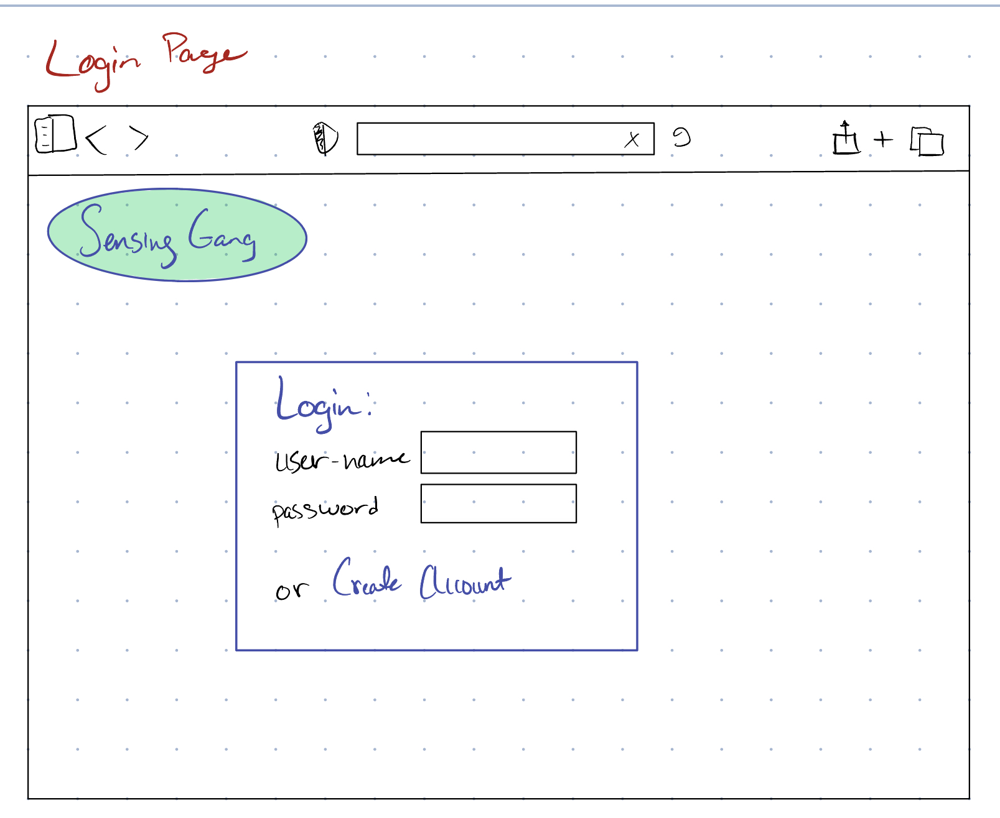
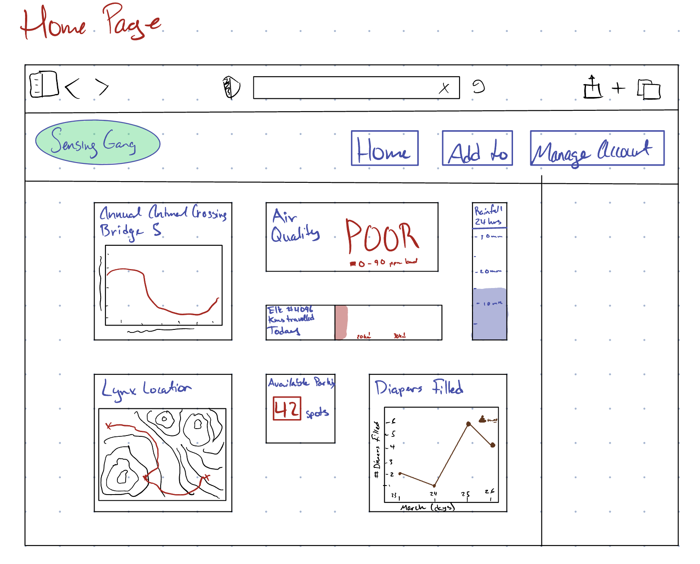

# Milestone 4

We will be employing the Agile sprint methodology, whereby we’ve determined products that will be completed at the end of each of these sprints. We have divvied the overall project into two major components - the user facing and the broker aspects of the application. Our goal for this first sprint is to complete the user facing aspect of the application. We have further divvied the user facing aspect of the application into 4 categories: Login, UI, Subscribing, and Graphical representation. Each of our members will be responsible for one of these categories, which they will further subdivide into issues, each of which will have a test, and once the test for each component is written, the code will be written, followed by further tests as necessary. Issues can be found on this dashboard page as well as on Github. 

# Checkpoints:

- [ ]  Checkpoint 1: Completion of User facing components of the application
March 30, 2023
- [ ]  Checkpoint 2: Database/API configuration 
April 5, 2023
- [ ]  Checkpoint 3: Project End tests and integration
April 8, 2023
- [ ]  Checkpoint 4: Video 
April 9, 2023
- [ ]  Final Report and Project Completion April 10, 2023

# Checkpoint 0 (Milestone 4 Submission) Summary:

Our goals for this first checkpoint in the development stage were to:

- Agree on code standards to streamline integration
- Establish a git workflow for the project
- Final confirmation on general code structure
    - Module structure
    - Level of abstraction for ease of testing and reuse
- Deciding which feature to prioritize
    - User facing components were chosen as we’re all using a new framework, so the familiarity of the task and our knowledge on testing it will act as training wheels so that we can be more comfortable with the framework and processes by the time we enter unfamiliar territory
- Establishing our timeline
    - Estimating time of completion for different tasks
    - Adapting our timeline based on other classes to minimize interference
    - Implementing buffers to account for project sections taking more time than expected
- Design and prototype the login and home pages
- Individually divvy our tasks into issues (tasks) to further improve time management and goal understanding
- Begin completing issues

# *Checkpoint 1:*

# UI: Sam

## Issues (tasks) to do:

- Create home page view
- Create home page model
- Migrate home page database
- Map home page URL
- Create home page template
- Modify View
- Map buttons for different pages (apps)

## Issues done:

- Design login concept drawing
- Design home page concept drawing

## Tests:

# Subscribing: Mac

## Issues (tasks) to do:

- Determine functionality of subscriptions
- Create subscription app
- Write tests for subscription methods
- Create subscription view
- Map view to URL
- Create subscription template html
- Explore connection between server and devices
- Display subscriptions

## Issues done:

- created subscription app
- created test view to URL - checking django functionality
- failing test for connection
- failing test for subscription
- 

## Tests:

- test connection to server
- testing the connection parameters: broker address, port, username, and password
- test subscription method
- test for logged in user subscription
- test for non-logged in user subscription
- test publish method
- test data flow from subscription
- test message handling
- test for multiple subscriptions handling
- test to unsubscribe

# Login: Joss

## Issues (tasks) to do:

- import django authorization and migrate to create necessary database tables
- Create superuser (admin)
- Create basic start/home page
- map view to url
- create login page, redirect to home after successful login
- create logout page , redirect to home after successful login
- create user registration page

## Issues done:

- Create login app

## Tests:

### Account Creation Unit Tests

- Register Authorization
- Valid user registration
- Test for invalid password format on account creation (too long and too short)
- Test for passwords matching on account creation
- Test for valid email upon account creation (does it include an @?)

### Login Unit Tests

- Test a successful login
- Test an invalid login
- Test when no username is filled in
- Test when no password is filled in

# Graphs: Aryan

## Issues (tasks) to do:

- Define the requirements for the graphical representation, including the type of charts or graphs needed and the data to be displayed.
- Create a Django view or API endpoint that retrieves the necessary data from the sensors and/or database.
- Return JSON data for graphical representation.
- Choose a suitable charting library for Django and integrate it into the website (plotly, matplotlib, chart.js)
- Implement the necessary code to display the data using the chosen charting library.
- Ensure that the charts and graphs are responsive and mobile-friendly.
- Implement any necessary features, such as zooming or filtering, to improve the user experience.
    - Asynchronous update on the chart representation ie. dynamic data visualization using AJAX and JavaScript
- Test the graphical representation thoroughly to ensure that it is displaying the data correctly and that it is user-friendly

## Issues done:

- Selected Chart.js as a suitable charting library (might change depending on implementation).

## Tests:

- Test the graphical representation on different devices and browsers to ensure that it is responsive and mobile-friendly.
    - 1. Test the dynamic data visualization and ensure it is functioning properly
- Test the data displayed on the charts and graphs to ensure that it is accurate and up-to-date.
- Test any necessary features, such as zooming or filtering, to ensure that they are working correctly and improving the user experience.
- Test Asynchronous display of the graphical representation.
